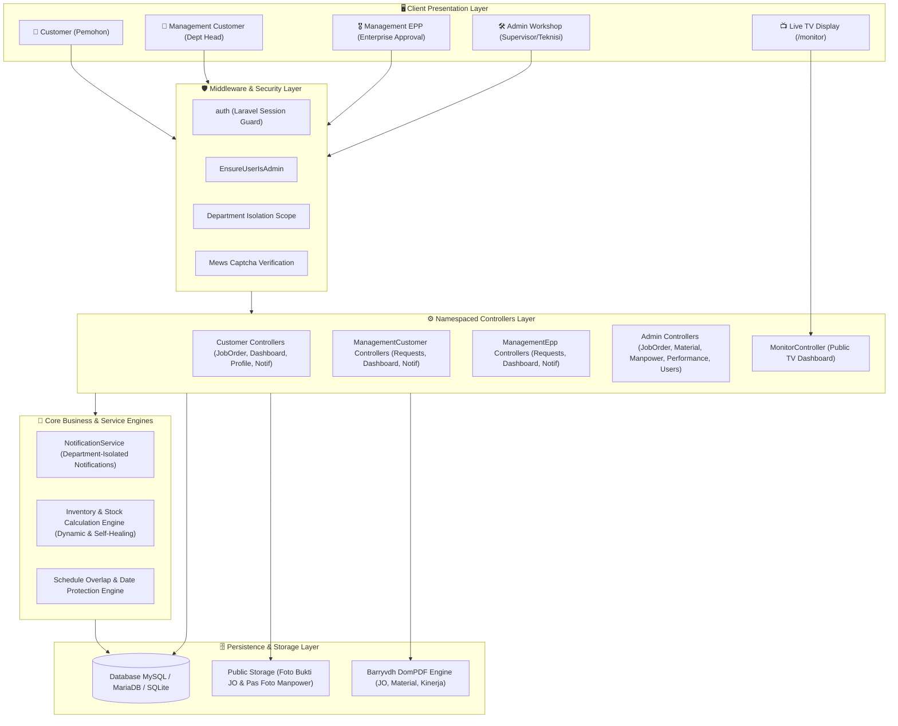
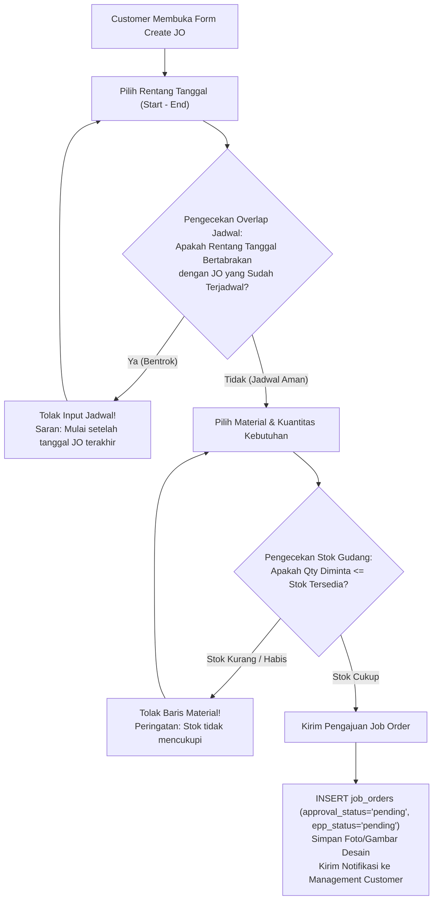

# ⚙️ Sistem Workshop - Enterprise Job Order & Inventory Management Platform

<p align="center">
  
</p>

<p align="center">
  <strong>Platform Terpadu Manajemen Pengerjaan Bengkel (Job Order), Kontrol Inventaris Material, Penilaian Kinerja Manpower, dan Live TV Monitoring Produksi Berbasis Persetujuan Berjenjang (Multi-Tier Approval)</strong>
</p>

<p align="center">
  
  
  
  
  
  
</p>

---

## 📑 Daftar Isi
1. [Ringkasan Proyek & Filosofi Sistem](#-ringkasan-proyek--filosofi-sistem)
2. [Arsitektur Sistem (System Architecture)](#-arsitektur-sistem-system-architecture)
   - [Diagram Arsitektur Tingkat Tinggi](#diagram-arsitektur-tingkat-tinggi)
   - [Lapisan Arsitektur (Architectural Layers)](#lapisan-arsitektur-architectural-layers)
   - [Struktur Direktori Proyek](#struktur-direktori-proyek)
3. [Peran Pengguna & Hak Akses (User Roles & Permissions)](#-peran-pengguna--hak-akses-user-roles--permissions)
   - [Rincian Otoritas & Tanggung Jawab Role](#rincian-otoritas--tanggung-jawab-role)
   - [Matriks Hak Akses (RBAC Matrix)](#matriks-hak-akses-rbac-matrix)
4. [Alur Proses Bisnis & Siklus Hidup Sistem (System Workflows)](#-alur-proses-bisnis--siklus-hidup-sistem-system-workflows)
   - [1. Alur Registrasi & Autentikasi Customer](#1-alur-registrasi--autentikasi-customer)
   - [2. Alur Pengajuan Job Order & Proteksi Bentrok Jadwal](#2-alur-pengajuan-job-order--proteksi-bentrok-jadwal)
   - [3. Alur Verifikasi & Persetujuan Berjenjang (Two-Tier Approval)](#3-alur-verifikasi--persetujuan-berjenjang-two-tier-approval)
   - [4. Alur Pemotongan & Sinkronisasi Stok Material Otomatis](#4-alur-pemotongan--sinkronisasi-stok-material-otomatis)
   - [5. Alur Pelaksanaan Pengerjaan & Pembaruan Progres Workshop](#5-alur-pelaksanaan-pengerjaan--pembaruan-progres-workshop)
   - [6. Alur Penolakan (Rejection) & Pengajuan Ulang (Resubmission)](#6-alur-penolakan-rejection--pengajuan-ulang-resubmission)
   - [7. Alur Engine Notifikasi Terisolasi Departemen](#7-alur-engine-notifikasi-terisolasi-departemen)
   - [8. Alur Live Monitoring Display Workshop (TV Kiosk)](#8-alur-live-monitoring-display-workshop-tv-kiosk)
5. [Fitur-Fitur Unggulan Sistem (Key Features Breakdown)](#-fitur-fitur-unggulan-sistem-key-features-breakdown)
6. [Skema Database & Model Relasional](#-skema-database--model-relasional)
7. [Panduan Instalasi & Menjalankan Aplikasi (Setup Guide)](#-panduan-instalasi--menjalankan-aplikasi-setup-guide)
   - [Prasyarat Sistem](#prasyarat-sistem)
   - [Langkah-Langkah Instalasi](#langkah-langkah-instalasi)
   - [Akun Bawaan Pengujian (Default Seed Accounts)](#akun-bawaan-pengujian-default-seed-accounts)
8. [Panduan Deployment ke Server Produksi](#-panduan-deployment-ke-server-produksi)

---

## 📖 Ringkasan Proyek & Filosofi Sistem

**Sistem Workshop** adalah platform enterprise manajemen operasional bengkel (*workshop*), fabrikasi, dan perawatan permesinan industri. Sistem ini menjembatani kolaborasi antara pemohon pengerjaan (**Customer** dari berbagai departemen seperti Produksi, Teknisi, Administrasi, dan Gudang), atasan internal departemen pemohon (**Management Customer**), pengambil keputusan perencanaan korporat (**Management EPP** - *Enterprise Production Planning*), serta tim eksekutor bengkel (**Admin Workshop**).

### Nilai Utama Sistem (*Core Values*):
1. **Transparansi Operasional**: Setiap permintaan pekerjaan memiliki status yang jelas dan dapat dipantau secara langsung melalui portal pengguna maupun layar monitor publik (*Live TV Display*) di lantai bengkel.
2. **Akuntabilitas Finansial & Otorisasi Berjenjang**: Menerapkan validasi persetujuan dua tahap (*Two-Tier Approval*). Pekerjaan hanya dapat dikerjakan dan material hanya dipotong dari gudang setelah disetujui oleh Management Customer serta Management EPP.
3. **Efisiensi Inventaris & Anti Selisih Stok**: Mutasi material tercatat presisi dengan model *post-approval stock deduction*, peringatan dini batas aman (*Safety Stock Alarm*), dan mekanisme *self-healing cache* stok.
4. **Proteksi Penjadwalan Cerdas (*Smart Scheduling*)**: Sistem mencegah tumpang tindih (*overlap*) tanggal pengerjaan antar-proyek di lini bengkel, sehingga antrean fabrikasi berjalan tertib.

---

## 🏛️ Arsitektur Sistem (System Architecture)

Sistem dibangun dengan prinsip arsitektur modern **Model-View-Controller (MVC)** menggunakan framework **Laravel 12** berbasis **PHP 8.2+**, antarmuka dinamis **Tailwind CSS 3.x**, interaktivitas sisi klien **Alpine.js**, engine keamanan **Mews Captcha**, serta generator dokumen **Barryvdh DomPDF**.

### Diagram Arsitektur Tingkat Tinggi



### Lapisan Arsitektur (Architectural Layers)

1. **Presentation Layer (Antarmuka Pengguna)**:
   - **Modular Role Layouts**: Memisahkan 4 layout navigasi independen sesuai peran pengguna (`layouts.admin`, `layouts.customer`, `layouts.management-customer`, dan `layouts.management-epp`).
   - **Kiosk / Live TV Monitor (`views/monitor.blade.php`)**: Antarmuka layar penuh (*full-width*) tanpa login untuk display TV di area workshop. Dilengkapi jam digital real-time, ringkasan proyek urgent, distribusi pekerjaan per seksi, indikator material kritis, serta filter departemen interaktif.
   - **Tailwind CSS & Flatpickr**: Desain responsif dengan penandaan status berbasis warna (*badge indicator*), tabel mutasi rapi, modal detail berkas, dan kalender pemilihan rentang tanggal dengan blokade tanggal yang telah terpakai.

2. **Security & Authorization Layer**:
   - **RBAC (Role-Based Access Control)**: Membagi peran secara tegas (`admin`, `customer`, `management-customer`, `management-epp`).
   - **Isolasi Departemen (*Department Isolation*)**: Customer dan Management Customer hanya memiliki visibilitas data ke Job Order dari departemen mereka sendiri, melindungi kerahasiaan antar-divisi.
   - **Pencegahan Bot / Spam**: Proteksi form registrasi dan login menggunakan captcha grafis lokal (`mews/captcha`).

3. **Application & Controller Layer (Namespaced Architecture)**:
   - Controllers dikelompokkan secara terisolasi dalam namespace `App\Http\Controllers\Admin`, `Customer`, `ManagementCustomer`, dan `ManagementEpp` guna menjamin kebersihan kode dan kemudahan skalabilitas.

4. **Business Service Layer**:
   - `NotificationService`: Pusat pengiriman notifikasi terstruktur dengan penargetan departemen otomatis.
   - **Dynamic Stock Calculation**: Perhitungan stok real-time yang memadukan pencatatan mutasi masuk, mutasi keluar, dan konsumsi Job Order dengan mekanisme *self-healing cache* pada kolom `stok_current`.
   - **Schedule Conflict Detector**: Algoritma pengecekan bentrok jadwal pekerjaan pengerjaan bengkel.

5. **Persistence & Export Layer**:
   - Relasi data Eloquent ORM dengan integritas kunci asing (*foreign keys*) dan *soft deletes* pada tabel material.
   - Generator dokumen cetak resmi PDF untuk Form Job Order, Laporan Material, Laporan Perpindahan Stok, dan Evaluasi Performa Karyawan.

---

### Struktur Direktori Proyek

```text
Sistem-Workshop/
├── app/
│   ├── Http/
│   │   ├── Controllers/
│   │   │   ├── Admin/                      # Kontroler Operasional Bengkel & Master Data
│   │   │   │   ├── ChecklistQualityItemController.php
│   │   │   │   ├── CustomerController.php  # Manajemen Akun Pelanggan oleh Admin
│   │   │   │   ├── DashboardController.php # Dashboard Statistik Lengkap Admin
│   │   │   │   ├── DepartementController.php
│   │   │   │   ├── JabatanController.php
│   │   │   │   ├── JobOrderController.php  # Eksekusi, Progress, Actual Date, PDF JO
│   │   │   │   ├── KategoriController.php
│   │   │   │   ├── ManpowerController.php  # Master Data Teknisi Workshop
│   │   │   │   ├── MaterialController.php
│   │   │   │   ├── MaterialKeluarController.php
│   │   │   │   ├── MaterialMasukController.php
│   │   │   │   ├── NotificationController.php
│   │   │   │   ├── PerformanceController.php # Penilaian Kinerja Bulanan Manpower
│   │   │   │   ├── ProfileController.php
│   │   │   │   ├── SatuanController.php
│   │   │   │   └── UserController.php     # Manajemen Akun Internal Sistem
│   │   │   ├── Customer/                   # Kontroler Pemohon Pengerjaan
│   │   │   │   ├── DashboardController.php
│   │   │   │   ├── JobOrderController.php  # Form Pengajuan JO, Validasi Stok & Jadwal
│   │   │   │   ├── NotificationController.php
│   │   │   │   └── ProfileController.php
│   │   │   ├── ManagementCustomer/         # Kontroler Persetujuan Tahap 1 (Dept Head)
│   │   │   │   ├── DashboardController.php
│   │   │   │   ├── NotificationController.php
│   │   │   │   ├── ProfileController.php
│   │   │   │   └── RequestController.php   # Approve / Reject Tahap 1
│   │   │   ├── ManagementEpp/              # Kontroler Persetujuan Final & Stok
│   │   │   │   ├── DashboardController.php
│   │   │   │   ├── NotificationController.php
│   │   │   │   ├── ProfileController.php
│   │   │   │   └── RequestController.php   # Approve Final & Auto Potong Stok Material
│   │   │   ├── AuthController.php          # Login, Logout, Captcha
│   │   │   ├── CustomerRegistrationController.php # Registrasi Mandiri Customer
│   │   │   ├── MaterialController.php      # Master Material & Export PDF
│   │   │   ├── MaterialMovementController.php # Mutasi Stok Masuk/Keluar & PDF
│   │   │   └── MonitorController.php       # Live TV Kiosk Monitoring Publik
│   │   └── Middleware/
│   │       └── EnsureUserIsAdmin.php       # Guard Khusus Akses Administrator
│   ├── Models/
│   │   ├── ChecklistQualityItem.php        # Item Standar Uji Kelayakan Mutu
│   │   ├── Customer.php                    # Entitas Customer
│   │   ├── Departement.php                 # Master Divisi/Departemen
│   │   ├── Jabatan.php                     # Master Jabatan Perusahaan
│   │   ├── JobOrder.php                    # Model Inti Pengerjaan & Status Approval
│   │   ├── JobOrderItem.php                # Rincian Material yang Digunakan per JO
│   │   ├── Kategori.php                    # Kategori Material
│   │   ├── Manpower.php                    # Data Teknisi/Pekerja Workshop
│   │   ├── Material.php                    # Inventaris Material & Perhitungan Stok
│   │   ├── MaterialMovement.php            # Histori Log Mutasi Stok (In/Out/JO)
│   │   ├── Notification.php                # Notifikasi Terpadu In-App
│   │   ├── Performance.php                 # Penilaian Produktivitas & Mutu Teknisi
│   │   ├── Satuan.php                      # Satuan Unit Material (Pcs, Kg, Batang)
│   │   └── User.php                        # Akun Pengguna & Relasi Organisasi
│   └── Services/
│       └── NotificationService.php         # Engine Notifikasi Lintas Departemen
├── database/
│   ├── migrations/                         # Struktur Tabel Relasional
│   └── seeders/                            # Seeder Master Data, Akun Default & Demo
├── resources/
│   └── views/
│       ├── admin/                          # Tampilan Panel Operasional Admin
│       ├── customer/                       # Tampilan Panel Pemohon Customer
│       ├── management-customer/            # Tampilan Panel Persetujuan Tahap 1
│       ├── management-epp/                 # Tampilan Panel Persetujuan Final EPP
│       ├── layouts/                        # 4 Layout Khusus Peran Pengguna
│       ├── monitor.blade.php               # Tampilan Live TV Monitor Lantai Bengkel
│       └── auth/                           # Form Login & Registrasi Customer
└── routes/
    └── web.php                             # Definisi Rute Terpadu & Proteksi Peran
```

---

## 👥 Peran Pengguna & Hak Akses (User Roles & Permissions)

Sistem membagi wewenang ke dalam 4 peran akun terautentikasi dan 1 akses publik:

```
                            ┌────────────────────────┐
                            │    Admin Workshop      │
                            │ (Operasional & Master) │
                            └───────────┬────────────┘
                                        │
             ┌──────────────────────────┴──────────────────────────┐
             ▼                                                     ▼
┌─────────────────────────┐                               ┌─────────────────────────┐
│        Customer         │                               │     Management EPP      │
│  (Pemohon Pengerjaan)   │                               │ (Otoritas Final & Stok) │
└────────────┬────────────┘                               └────────────▲────────────┘
             │                                                         │
             │ Mengajukan JO                                           │ Persetujuan Tahap 2
             ▼                                                         │
┌─────────────────────────┐                                            │
│   Management Customer   │────────────────────────────────────────────┘
│  (Approval Tahap 1 Dept)│ Persetujuan Tahap 1
└─────────────────────────┘
```

### Rincian Otoritas & Tanggung Jawab Role

#### 1. 🛠️ Admin Workshop (`admin`)
- **Fokus Utama**: Menjalankan operasional bengkel, memelihara master data, mengontrol gudang material, dan memantau kualitas kerja.
- **Wewenang**:
  - **Manajemen Job Order**: Mengakses seluruh Job Order yang telah disetujui final (*Fully Approved*), memperbarui persentase progres (0% – 100%), menetapkan tanggal selesai aktual (*Actual Date*), mengganti status (*Normal/Urgent*), dan mengisi evaluasi pengerjaan.
  - **Manajemen Inventaris Material**: Menambah, mengedit, dan menghapus master material, menentukan batas *safety stock*, mencatat stok masuk (*Stock In*), mencatat stok keluar non-JO (*Stock Out*), serta mengunduh rekap stok PDF.
  - **Manajemen Teknisi & Kinerja**: Mengelola data teknisi (*Manpower*), mencatat evaluasi kinerja periodik (*Performance Evaluation*), dan mencetak laporan kinerja PDF.
  - **Manajemen Master Organisasi**: Mengelola master data Departemen, Jabatan, Kategori Material, Satuan, dan Checklist Quality.
  - **Manajemen Pengguna**: Mengontrol akun internal (`users`) dan akun eksternal (`customers`).

#### 2. 👤 Customer (`customer`)
- **Fokus Utama**: Pemohon pekerjaan perbaikan, modifikasi, atau fabrikasi peralatan kerja dari departemen tertentu.
- **Wewenang**:
  - **Registrasi Akun Mandiri**: Mendaftar akun dengan menentukan nama departemen dan melewati verifikasi Captcha.
  - **Pengajuan Job Order**: Mengisi data proyek, latar belakang, target, tujuan, melampirkan foto/gambar teknis, memilih tanggal pengerjaan (dilindungi fitur anti bentrok jadwal), dan memilih kebutuhan material gudang.
  - **Pengajuan Ulang (*Resubmission*)**: Memperbaiki dan mengirim kembali Job Order jika ditolak oleh atasan departemennya.
  - **Pelacakan Status Real-Time**: Memantau perkembangan approval dan progres fisik pengerjaan bengkel.
  - **Cetak Lembar Job Order**: Mengunduh berkas pengajuan dalam format dokumen PDF resmi.

#### 3. 👔 Management Customer (`management-customer`)
- **Fokus Utama**: Kepala departemen / atasan langsung pemohon yang memvalidasi urgensi dan kebutuhan pekerjaan unit kerjanya.
- **Wewenang**:
  - **Approval Tahap 1**: Menyetujui (*Approve*) atau Menolak (*Reject* disertai alasan penolakan wajib) pengajuan Job Order dari staf departemennya sendiri.
  - **Isolasi Departemen**: Terisolasi penuh dari Job Order milik departemen lain demi menjaga kerahasiaan divisi.
  - **Tinjauan Berkas**: Memeriksa deskripsi pekerjaan, foto kerusakan/desain, jadwal yang diajukan, dan taksiran material.
  - **Ekspor Dokumen PDF**: Mengunduh salinan berkas pengajuan Job Order.

#### 4. 🎖️ Management EPP (`management-epp`)
- **Fokus Utama**: Otoritas tertinggi perencanaan produksi pabrik (*Enterprise Production Planning*) yang mengontrol kapasitas beban kerja bengkel dan pengeluaran material perusahaan.
- **Wewenang**:
  - **Approval Tahap 2 (Final Authority)**: Mengesahkan Job Order yang telah disetujui oleh Management Customer dari seluruh departemen.
  - **Pemicu Pemotongan Stok Otomatis**: Ketika Management EPP mengklik *Approve*, sistem secara otomatis memotong stok material dari inventaris gudang dan menerbitkan nomor mutasi keluar (`MaterialMovement`).
  - **Monitoring Global**: Memantau kapasitas antrean pekerjaan di seluruh workshop secara menyeluruh.
  - **Ekspor Dokumen PDF**: Mengunduh berkas Job Order lengkap beserta riwayat paraf persetujuan.

#### 5. 📺 Akses Publik / Kiosk Display (`guest` via `/monitor`)
- **Fokus Utama**: Display televisi di lantai produksi bengkel yang menyajikan informasi terbuka bagi para mekanik dan teknisi lapangan.
- **Wewenang**:
  - Dapat diakses tanpa login (*read-only*).
  - Menampilkan jam kerja sinkron, daftar pekerjaan berstatus Urgent, indikator material kritis di bawah *safety stock*, dan tabel antrean kerja aktif lengkap dengan bilah progres (*progress bar*).

---

### Matriks Hak Akses (RBAC Matrix)

| Fitur & Fungsionalitas | Publik / TV | Customer | Mgmt Customer | Mgmt EPP | Admin Workshop |
|:---|:---:|:---:|:---:|:---:|:---:|
| Akses Live TV Display (`/monitor`) | ✅ | ✅ | ✅ | ✅ | ✅ |
| Registrasi Akun Customer Baru | ✅ | ❌ | ❌ | ❌ | ❌ |
| Membuat Pengajuan Job Order Baru | ❌ | ✅ | ❌ | ❌ | ✅ |
| Mengedit & Mengajukan Ulang JO Ditolak | ❌ | ✅ | ❌ | ❌ | ❌ |
| Approval Tahap 1 (Internal Departemen) | ❌ | ❌ | ✅ | ❌ | ❌ |
| Approval Tahap 2 (Final & Potong Stok) | ❌ | ❌ | ❌ | ✅ | ❌ |
| Update Progres Pengerjaan (0-100%) | ❌ | ❌ | ❌ | ❌ | ✅ |
| Update Tanggal Selesai Aktual (`actual`) | ❌ | ❌ | ❌ | ❌ | ✅ |
| Cetak Lembar Job Order PDF | ❌ | ✅ | ✅ | ✅ | ✅ |
| Kelola Master Material & Safety Stock | ❌ | ❌ | ❌ | ❌ | ✅ (CRUD) |
| Catat Mutasi Stok Masuk / Keluar Manual | ❌ | ❌ | ❌ | ❌ | ✅ |
| Cetak Laporan Inventaris & Mutasi PDF | ❌ | ❌ | ❌ | ❌ | ✅ |
| Kelola Data Teknisi (*Manpower*) | ❌ | ❌ | ❌ | ❌ | ✅ (CRUD) |
| Penilaian Kinerja Bulanan & Cetak PDF | ❌ | ❌ | ❌ | ❌ | ✅ |
| Kelola Master Organisasi (Dept, Jabatan) | ❌ | ❌ | ❌ | ❌ | ✅ (CRUD) |
| Kelola Akun Staf & Akun Customer | ❌ | ❌ | ❌ | ❌ | ✅ (CRUD) |
| Menerima Notifikasi In-App Departemen | ❌ | ✅ | ✅ | ✅ | ✅ |

---

## 🔄 Alur Proses Bisnis & Siklus Hidup Sistem (System Workflows)

### 1. Alur Registrasi & Autentikasi Customer

```
[Calon Customer] ───> Mengakses /register-customer
         │
         ├───> Mengisi Form: Nama, Username, Email, Password, Departemen & Kode Captcha
         │
         ▼
[Validasi Sistem] ───> Pengecekan Keunikan Data & Validasi Kode Captcha
         │
         ├── [Gagal]  ───> Refresh Captcha & Tampilkan Pesan Error
         └── [Sukses] ───> INSERT INTO users (role='customer', department_id=...)
                           INSERT INTO customers (...)
                                 │
                                 ▼
                     Redirect ke Halaman Login (/login)
```

---

### 2. Alur Pengajuan Job Order & Proteksi Bentrok Jadwal

Saat Customer menyusun pengajuan pekerjaan, sistem memberlakukan dua lapis proteksi validasi:



> [!NOTE]
> **Model Pengurangan Stok Pasca-Approval**: Pada saat Job Order baru dibuat, stok material **belum dipotong**, melainkan hanya divalidasi ketersediaannya. Hal ini mencegah penguncian material jika pengajuan pada akhirnya dibatalkan atau ditolak.

---

### 3. Alur Verifikasi & Persetujuan Berjenjang (Two-Tier Approval)

Siklus hidup persetujuan Job Order dirancang berjenjang untuk mencegah penyalahgunaan aset:

```
                  [Customer Mengajukan Job Order Baru]
                                    │
                                    ▼
                     [Status: approval_status = 'pending']
                                    │
                  ┌─────────────────┴─────────────────┐
                  │                                   │
                  ▼                                   ▼
        [Management Customer]               [Management Customer]
           MENOLAK (Reject)                   MENYETUJUI (Approve)
                  │                                   │
                  ▼                                   ▼
      [Status: 'rejected']              [Status: 'approved']
      Customer Dapat Merevisi           Melangkah ke Persetujuan Tahap 2
      & Mengajukan Ulang (Resubmit)                   │
                                                      ▼
                                       [Status: epp_approval_status = 'pending']
                                                      │
                                                      ▼
                                              [Management EPP]
                                            MENYETUJUI (Final Approve)
                                                      │
                                                      ▼
                                       ┌─────────────────────────────┐
                                       │ 1. epp_status = 'approved'  │
                                       │ 2. AUTO-DEDUCT STOK MATERIAL│
                                       │ 3. JO Resmi Masuk Antrean   │
                                       │    Workshop & Live Monitor  │
                                       └─────────────────────────────┘
```

---

### 4. Alur Pemotongan & Sinkronisasi Stok Material Otomatis

Ketika Management EPP menyetujui Job Order, transaksi database atomik dijalankan:

1. Status `epp_approval_status` diubah menjadi `approved` dan mencatat `epp_approved_by` serta `epp_approved_at`.
2. Untuk setiap item material pada `job_order_items`:
   - Dibuat entri baru pada tabel `material_movements` dengan atribut:
     - `type = 'out'`
     - `movement_type = 'jo'`
     - `keterangan = 'Job Order Approved #ID'`
     - `jumlah = item.jumlah`
3. Engine model `Material` memperbarui cache kolom `stok_current`.
4. Jika stok material yang tersisa berada di bawah nilai `safety_stock`, material tersebut secara otomatis ditandai sebagai **Material Kritis** pada Dashboard Admin dan Layar Monitoring TV.

---

### 5. Alur Pelaksanaan Pengerjaan & Pembaruan Progres Workshop

Setelah Job Order berstatus *Fully Approved*:
1. Proyek tampil di **Antrean Pengerjaan Admin Workshop** dan **Layar Monitor Publik**.
2. Tim bengkel mulai mengerjakan fabrikasi/perbaikan.
3. Supervisor/Admin Workshop memperbarui parameter secara berkala:
   - **Progress Slider**: Progres pengerjaan fisik dari 0% hingga 100%.
   - **Status Urgensi**: Menandai *Normal* atau *Urgent* (akan memicu warna merah menyala pada monitor).
   - **Checklist Quality**: Memeriksa item uji kelayakan mutu pekerjaan.
   - **Actual Finish Date**: Menginput tanggal riil penyelesaian pekerjaan saat progres mencapai 100%.
   - **Catatan Evaluasi**: Catatan teknis hasil uji coba peralatan.
4. Setiap pembaruan progres akan mengirimkan notifikasi instan ke dashboard Customer pemohon.

---

### 6. Alur Penolakan (Rejection) & Pengajuan Ulang (Resubmission)

Jika Management Customer menilai pengajuan belum layak:
1. Management Customer menekan tombol **Reject** dan wajib menginput **Alasan Penolakan** (maksimal 500 karakter).
2. Status berubah menjadi `rejected` dan riwayat alasan penolakan tersimpan di `rejection_reason`.
3. Customer menerima notifikasi penolakan beserta alasannya.
4. Tombol **Edit** aktif pada dashboard Customer untuk Job Order terkait.
5. Customer memperbaiki rincian data atau material, kemudian melakukan *Resubmit*. Status kembali menjadi `pending` untuk ditinjau ulang oleh atasan.

---

### 7. Alur Engine Notifikasi Terisolasi Departemen

`NotificationService` mengatur distribusi pesan secara cerdas:
- **Event `Job Order Created`**: Notifikasi diarahkan secara eksklusif ke pengguna dengan peran `management-customer` yang memiliki `department_id` sama dengan pemohon.
- **Event `Approved Stage 1`**: Notifikasi terkirim ke pemohon (mengabarkan lolos tahap 1) dan ke seluruh akun `management-epp` (mengabarkan adanya permintaan approval final).
- **Event `Fully Approved by EPP`**: Notifikasi terkirim ke pemohon dan seluruh staf `admin` workshop bahwa pengerjaan siap dieksekusi.
- **Event `Progress Updated / Completed`**: Notifikasi terkirim ke pemohon mengenai persentase kemajuan pengerjaan.

---

### 8. Alur Live Monitoring Display Workshop (TV Kiosk)

```
[TV Monitor di Lantai Workshop] ───> Mengakses URL: /monitor (Tanpa Login)
                                           │
                                           ├── Menampilkan Jam Digital & Tanggal Sinkron Server
                                           │
                                           ├── Panel Widget Urgent:
                                           │   - Menampilkan proyek urgent yang mendekati deadline
                                           │   - Menampilkan frekuensi beban kerja per seksi
                                           │
                                           ├── Panel Alarm Material Kritis:
                                           │   - Menampilkan material dengan (stok_current < safety_stock)
                                           │
                                           └── Tabel Antrean Job Order Aktif:
                                               - Hanya menampilkan JO berstatus Fully Approved
                                               - Menampilkan progress bar interaktif, seksi, tanggal & evaluasi
                                               - Fitur pemfilteran departemen secara realtime
```

---

## ✨ Fitur-Fitur Unggulan Sistem (Key Features Breakdown)

### 1. 📋 Manajemen Job Order Pintar
- **Form Pendaftaran Fleksibel**: Mendukung input multi-baris material dengan spesifikasi kustom dan satuan dinamis.
- **Upload Multi-Gambar**: Dukungan unggah gambar/desain teknis proyek hingga format resolusi tinggi.
- **Pelindung Overlap Kalender**: Pengecekan otomatis di sisi klien dan server untuk mencegah tabrakan jadwal pengerjaan antar-proyek bengkel.

### 2. 🔐 Persetujuan Berjenjang (Multi-Tier Hierarchical Approval)
- **Otorisasi Dua Tahap**: Menjamin kesesuaian kebutuhan divisi (Tahap 1) dan ketersediaan kapasitas bengkel serta anggaran material (Tahap 2).
- **Audit Trail Lengkap**: Menyimpan jejak digital siapa yang menyetujui/menolak, waktu eksekusi persis, serta catatan penolakan.

### 3. 📦 Sistem Kontrol Inventaris Material & Mutasi
- **Kalkulasi Stok Dinamis**: Formula stok transparan: Stok Akhir = Stok Awal + Total Masuk - Total Keluar.
- **Fitur Self-Healing Cache**: Jika cache stok mengalami desinkronisasi data, model `Material` secara otomatis melakukan rekalkulasi mandiri dari histori pergerakan stok.
- **Safety Stock Warning**: Peringatan visual otomatis ketika persediaan gudang menipis guna mencegah kehabisan bahan baku saat fabrikasi berjalan.
- **Pencatatan Mutasi Manual**: Form pencatatan *Stock In* (pembelian/penerimaan) dan *Stock Out* (keperluan perawatan umum) lengkap dengan nomor referensi.

### 4. 👷 Manajemen Teknisi & Penilaian Kinerja Manpower
- **Database Karyawan Bengkel**: Profil lengkap teknisi mencakup NIK, nama, jabatan, kontak, serta foto profil.
- **Evaluasi Kinerja Berkala**: Formulir penilaian performa teknisi yang mencakup aspek kedisiplinan, produktivitas, dan kualitas pengerjaan.
- **Cetak Rapor Kinerja PDF**: Cetak rekap penilaian individu atau seluruh teknisi dalam format siap arsip.

### 5. 📺 Display TV Kiosk Monitoring Produksi
- **Ramah Layar Lebar**: Antarmuka kontras tinggi yang dirancang khusus untuk kenyamanan visual pada layar televisi bengkel.
- **Filter Departemen**: Memungkinkan teknisi memfilter antrean kerja berdasarkan divisi pemohon tertentu secara langsung di layar TV.

### 6. 📄 Ekspor Dokumen Resmi (DomPDF Engine)
- **Surat Perintah Kerja / Job Order Sheet**: Dokumen resmi pengerjaan lengkap dengan rincian material, paraf approval, dan tanda tangan pelaksana.
- **Katalog Material & Mutasi Gudang**: Ekspor buku inventaris dan mutasi keluar-masuk barang ke PDF.
- **Laporan Kinerja Manpower**: Rekapitulasi nilai performa bulanan.

---

## 🗄️ Skema Database & Model Relasional

Sistem menggunakan 16 tabel relasional yang terstruktur rapi:

```
┌─────────────────┐       N:1       ┌─────────────────┐
│      users      ├─────────────────┤  departements   │
└────────┬────────┘                 └────────┬────────┘
         │                                   │
         ├───────────────────────────────────┼─────────────────────────┐
         │ 1:N (created_by)                  │ 1:N (department_id)     │
         ▼                                   ▼                         │
┌─────────────────┐       1:N       ┌─────────────────┐                │
│   job_orders    ├─────────────────┤ job_order_items │                │
└────────┬────────┘                 └────────┬────────┘                │
         │                                   │ N:1                     │
         │ 1:N                               ▼                         │
         │                          ┌─────────────────┐                │
         │                          │    materials    │◄───────────────┤
         │                          └────────┬────────┘                │
         │                                   │ 1:N                     │
         │                                   ▼                         │
         │                          ┌─────────────────┐                │
         │                          │material_movements                │
         │                          └─────────────────┘                │
         ▼                                                             │
┌─────────────────┐                 ┌─────────────────┐                │
│  notifications  │                 │    customers    ├────────────────┘
└─────────────────┘                 └─────────────────┘
```

### Rangkuman Model Data Kunci:
- **`User`**: Akun pengguna, peran (`role`), relasi ke `departement_id` dan `jabatan_id`.
- **`JobOrder`**: Data induk proyek, tanggal `start`/`end`, progres (0-100), `status` (Normal/Urgent), `actual`, foto array JSON, `approval_status`, `approved_by`, `approved_at`, `rejection_reason`, `epp_approval_status`, `epp_approved_by`, `epp_approved_at`.
- **`JobOrderItem`**: Bahan material yang diajukan per JO (`job_order_id`, `material_id`, `spesifikasi`, `jumlah`, `satuan`).
- **`Material`**: Master inventaris material (`nama`, `spesifikasi`, `jumlah`, `safety_stock`, `satuan_id`, `kategori_id`, `stok_current`).
- **`MaterialMovement`**: Riwayat transaksi fisik barang (`material_id`, `type` in/out, `tanggal`, `jumlah`, `movement_type` jo/manual, `keterangan`).
- **`Manpower` & `Performance`**: Master data pekerja workshop dan tabel rekapitulasi penilaian kinerja bulanan.
- **`Notification`**: Riwayat alert notifikasi in-app dengan isolasi departemen.

---

## 🚀 Panduan Instalasi & Menjalankan Aplikasi (Setup Guide)

Ikuti panduan di bawah ini untuk menyiapkan dan menjalankan proyek di lingkungan pengembangan lokal (*Local Environment*).

### Prasyarat Sistem
Pastikan perangkat komputer Anda telah terpasang:
- **PHP** versi 8.2 atau lebih tinggi
- **Composer** (Dependency Manager PHP)
- **Node.js** (Minimal versi 18.x) & **NPM**
- **Database Server**: MySQL 8.0+, MariaDB 10.4+, atau SQLite
- **Git**

---

### Langkah-Langkah Instalasi

#### 1. Clone Repository
Buka terminal dan unduh repositori proyek:
```bash
git clone https://github.com/ISHASII/Sistem-Workshop.git
cd Sistem-Workshop
```

#### 2. Install Dependensi Backend (PHP)
```bash
composer install
```

#### 3. Install Dependensi Frontend (Node.js)
```bash
npm install
```

#### 4. Konfigurasi Environment (`.env`)
Salin file template `.env.example` ke `.env`:
```bash
# Pengguna Windows (PowerShell / Command Prompt)
copy .env.example .env

# Pengguna Linux / macOS
cp .env.example .env
```

Buka file `.env` dan sesuaikan koneksi database Anda:
```env
APP_NAME="Sistem Workshop"
APP_ENV=local
APP_KEY=
APP_DEBUG=true
APP_URL=http://localhost:8000

# Konfigurasi Database (Contoh MySQL)
DB_CONNECTION=mysql
DB_HOST=127.0.0.1
DB_PORT=3306
DB_DATABASE=sistem_workshop
DB_USERNAME=root
DB_PASSWORD=
```

#### 5. Generate Application Key
```bash
php artisan key:generate
```

#### 6. Buat Symbolic Link Storage
Agar foto dokumentasi Job Order dan foto Manpower dapat diakses publik dari browser:
```bash
php artisan storage:link
```

#### 7. Migrasi Database & Seeding Data Bawaan
Jalankan migrasi tabel beserta seeder master data dan akun demo:
```bash
php artisan migrate --seed
```

#### 8. Menjalankan Aplikasi
Jalankan server aplikasi secara terintegrasi menggunakan script Composer bawaan (menjalankan web server, worker antrean, logger, dan vite live-reload sekaligus):
```bash
composer run dev
```

Atau jalankan secara manual melalui 2 tab terminal terpisah:

**Terminal 1 (Laravel Server):**
```bash
php artisan serve
```

**Terminal 2 (Vite Asset Bundler):**
```bash
npm run dev
```

#### 9. Akses Sistem
Buka web browser dan akses alamat berikut:
- 🚪 **Halaman Login Utama**: 👉 **[http://localhost:8000](http://localhost:8000)**
- 📺 **Layar Live TV Monitoring Workshop**: 👉 **[http://localhost:8000/monitor](http://localhost:8000/monitor)**
- 📝 **Form Registrasi Customer Publik**: 👉 **[http://localhost:8000/register-customer](http://localhost:8000/register-customer)**

---

### Akun Bawaan Pengujian (Default Seed Accounts)

Setelah proses `migrate --seed` selesai, Anda dapat login menggunakan kredensial default berikut:

| Role Pengguna | Username | Password | Deskripsi Wewenang |
|:---|:---|:---:|:---|
| **Admin Workshop** | `admin` | `1234567890` | Akses penuh operasional, master material, manpower & update progress |
| **Management EPP** | `mjepp` | `1234567890` | Otoritas persetujuan final (Tahap 2) & pemotongan stok otomatis |
| **Customer (Demo)** | `testuser` | `password123` | Pengajuan Job Order baru & tracking progress pengerjaan |
| **Management Customer** | Buat via Admin / Seeder Dept | `1234567890` | Verifikasi awal (Tahap 1) untuk Job Order departemen terkait |

---

## 🛠️ Panduan Deployment ke Server Produksi

Ketika mendistribusikan aplikasi ke lingkungan produksi (*Production Server / VPS*):

1. **Kompilasi Asset Frontend**:
   ```bash
   npm run build
   ```
2. **Optimasi Cache Konfigurasi & Route**:
   ```bash
   php artisan config:cache
   php artisan route:cache
   php artisan view:cache
   ```
3. **Pengaturan `.env` Produksi**:
   ```env
   APP_ENV=production
   APP_DEBUG=false
   ```
4. **Izin Direktori Storage**:
   Pastikan web server memiliki izin menulis (*write permissions*) ke direktori `storage/` dan `bootstrap/cache/`:
   ```bash
   chmod -R 775 storage bootstrap/cache
   ```

---

<br/>

<p align="center">
  <strong>Sistem Workshop</strong> &copy; 2026. Seluruh hak cipta dilindungi undang-undang.<br/>
  <em>Manajemen Operasional Fabrikasi, Inventaris Material, dan Rekayasa Industri Berkelanjutan.</em>
</p>
